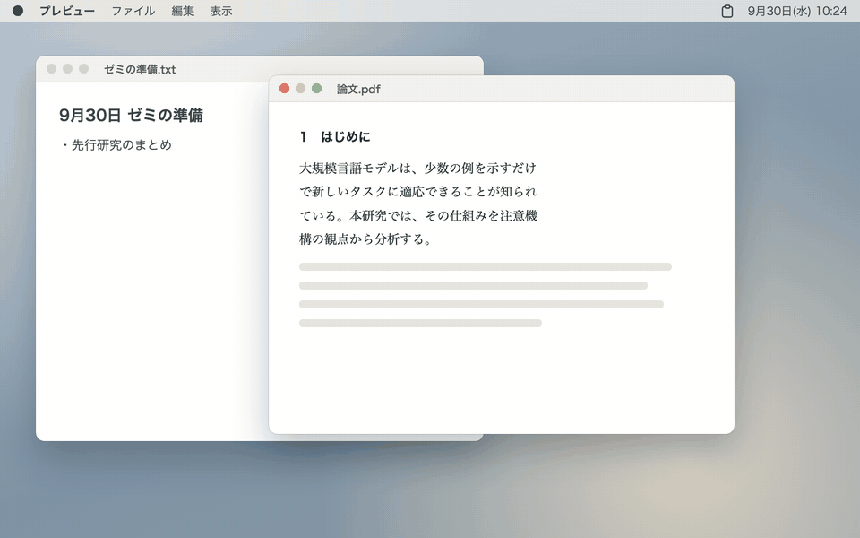

# Pastephant


Pastephant は、コピーした物を忘れない象の、macOS 用クリップボード履歴アプリです。

`⌘C` でコピーした文字・画像・表・ファイル・パワポの図形などを元の形のまま覚えておき、`⌥⌘V` で画面の端から呼び出して貼れます。貼る前に「改行を消す」「表 → LaTeX」などの貼り方を選んで、貼られる内容を先に確かめられます。タグ、定型文、数式画像、画像の文字認識、順番に貼るペーストスタックもそろっています。

[OpenSesame!](https://github.com/kobito-tools/OpenSesame) に登録すると1キーで開けます。共有タグで [Tomelet](https://github.com/kobito-tools/Tomelet)・[PopNote!](https://github.com/kobito-tools/PopNote) とつながり、選んだ項目をそのままメモに送れます。



## 動作環境

- macOS 13 以降（Apple Silicon / Intel）
- Tomelet・PopNote! は任意です（連携する場合だけ使います）

## ダウンロード

[Releases](../../releases/latest) ページから、次のどちらかをダウンロードしてください。どちらも Apple Silicon と Intel の Mac で動きます。

| 形式 | ファイル |
|---|---|
| dmg（おすすめ） | `Pastephant_x.y.z.dmg` |
| zip | `Pastephant_x.y.z_universal.zip` |

`x.y.z` にはバージョン番号が入ります。

## インストール

1. ダウンロードした `.dmg` ファイルを開き、表示された `Pastephant` を右の `Applications` フォルダにドラッグします（zip の場合は、展開された `Pastephant.app` を Applications フォルダに移動します）。
2. アプリケーションフォルダから Pastephant を起動します。Dock には出ず、メニューバーにクリップボードのアイコンが出ます。
3. dmg は Finder のサイドバーの「⏏」で取り出して、ゴミ箱に入れて構いません。

本アプリは Apple の公証を受けていないため、初回起動時に「開発元を確認できません」などの警告が表示されます。その場合は警告を閉じ、「システム設定」→「プライバシーとセキュリティ」を開いて、画面下部の「このまま開く」をクリックしてください。2 回目以降は通常どおり起動できます。

「壊れているため開けません」と表示される場合は、ターミナルで次のコマンドを実行してから、再度起動してください。

```bash
xattr -dr com.apple.quarantine "/Applications/Pastephant.app"
```

ソースから作る場合は、このリポジトリをクローンして `Pastephant-Setup.command` を実行します（Xcode Command Line Tools が必要です。詳しくは [docs/DEVELOPMENT.md](docs/DEVELOPMENT.md)）。

#### アクセシビリティの許可

選んだ項目を前のアプリに貼り込むために、アクセシビリティの許可を使います。初めて貼るときに求められるので、「システム設定」→「プライバシーとセキュリティ」→「アクセシビリティ」で Pastephant をオンにしてください。許可が無い間は、選んだ項目をクリップボードに戻すだけになります（自分で `⌘V` を押せば貼れます）。

#### 入力監視の許可

ペーストスタックを初めて使うときに求められます。`⌘V` が押されたことだけを見て、積んだ次の項目に入れ替えます。

どちらの許可も、設定（メニューバーのアイコン →「設定…」）の「一般」の一番上で状態を確かめられます。

## 使い方

コピーすると自動で履歴に入ります。`⌥⌘V` を押すと、画面の右端（設定で左端にも変えられます）からパネルが出てきます。貼り先のアプリのフォーカスはそのままなので、選んで `⏎` を押すだけで貼れます。

パネルは上から、検索欄、「プレビュー」の枠（選んでいる項目の中身と、その下に貼り方）、履歴のカード、いま使えるキーの案内です。カードの左の色の帯はコピー元のアプリごとの色（PopNote! のタグと同じ決め方）で、設定で種類ごと・タグごとにも変えられます。パネルの縁には、象の耳の小人がしがみついています（設定で隠せます）。

### 基本操作

覚えるキーは3つだけです。画面の下にも、いま使えるキーがいつも出ています。

| 操作 | 動作 |
|---|---|
| `⌥⌘V` | パネルを出す（もう一度押すか `esc` で閉じる） |
| `↑` `↓` | 項目を選ぶ。プレビューに中身が大きく出ます |
| `⏎` | いま選んでいる貼り方で貼る（ダブルクリックでも） |
| `⇥` / `⇧⇥` | 貼り方を切り替える |
| `→`（`⌘K`・右クリック） | この項目にできることを開く |

### 貼り方を選ぶ

プレビューの下に、選んだ項目に合う貼り方だけが並びます。`⇥` で切り替えると、プレビューには実際に貼られる内容が出ます。ほかの項目に移っても、その項目に同じ貼り方があれば続けて使います（パネルを開き直すと「そのまま」に戻ります）。

| 項目 | 並ぶ貼り方 |
|---|---|
| 文章 | そのまま・改行を消す・「，．」に（「、。」に）・半角英数に・数式画像に・★保存した組み合わせ |
| Excel などの表 | 書式付き・プレーン・表 → LaTeX・表 → Markdown・表 → CSV |
| ファイル | ファイル・パス・~ のパス・基準パスから・ファイル名・file:// |
| 画像 | 画像・画像の文字 |
| 数式 | 数式画像・LaTeX の式 |
| 複数選んだとき | そのまま・プレーン・改行を消す（文字をつないで貼る） |

最後の「ほかの変換…」を選んで `⏎` を押すと、全ての変換から選べます（下の「変換」）。

### できることは1文字で

`→` を押すと、その項目にできることが一覧で出ます。各行の左の文字を押すだけで実行します。行の右に出ている `⌘` のショートカットを覚えれば、一覧を開かずにも使えます。

| 文字 | 動作 | ショートカット |
|---|---|---|
| `C` | コピーだけ（貼らない） | `⌘⏎` |
| `T` | タグを付ける・外す | `⌘T` |
| `P` | ピン留めする | `⌘P` |
| `E` | 編集してから貼る | `⌘E` |
| `M` | 複数の項目を1つにまとめる | `⌘M` |
| `R` | 変換を選ぶ（つなげる・保存する） | |
| `L` | 数式画像を作る | `⌘L` |
| `K` | ペーストスタックに積む | |
| `S` | Tomelet に残す | `⌘S` |
| `N` / `A` | PopNote! の新しいメモにする / 開いているメモに足す | `⇧⌘N` / `⌥⇧⌘N` |
| `Q` | Quick Look | `⌘Y` |
| `D` | 履歴から削除 | `⌘⌫` |

### そのほかのキー

| キー | 内容 |
|---|---|
| 文字の入力 | 検索（本文・画像の文字・タグ・ファイル名・コピー元のアプリ名。空白で区切ると全てを含む物） |
| `⌃N` `⌃P` | 選択を移動（`⇧` を押しながらで複数選択。`⌘クリック`・`⇧クリック` も） |
| `⌘1`〜`⌘9` | 上から N 番目を貼る |
| `⇧⏎` / `⌥⏎` | 貼り方を切り替えずに、プレーンで / 改行を消して貼る |
| `⌃1`〜`⌃9` | 保存した変換の組み合わせ N で貼る |
| `⌥⌘↑` `⌥⌘↓` | ピンの並べ替え |
| `⌘N` | 新しい定型文 |
| 検索が空のときの `space` | Quick Look |
| `⌘/` `⌘,` | キーの一覧・設定 |
| `esc` | 戻る／検索を消す／閉じる |
| ドラッグ | ほかのアプリへドロップして取り出す |

### 検索と絞り込み

検索欄では、ふつうの語に加えて次の書き方で絞り込めます。右上のボタンで並べ替え（最後に使った順・コピーした順・使った回数順・種類ごと・コピー元のアプリごと）も選べます。

| 書き方 | 絞り込み |
|---|---|
| `#論文` | タグ |
| `type:画像`・`type:image`・`type:snippet` | 種類（テキスト・書式付き・画像・ファイル・リンク・色・オブジェクト・数式・定型文） |
| `app:Word` | コピー元のアプリ |
| `is:pinned` | ピン留めした物 |
| `after:2026-09-01`・`before:2026-09-30` | コピーした日 |
| `exported:2026-09-28` | その日に Tomelet に残した物 |

### タグ

`⌘T` で付けます。候補を `↑↓` で選んで `⏎`、候補が無ければ `⏎` で新しいタグを作ります。`⌫` で最後のタグを外します。

- 設定の「連携」で基準パス（Tomelet と同じフォルダ）を選ぶと、タグは Tomelet・PopNote! と共有されます（`.kobito-tools/Tags/tags.json`）。
- 設定の「取得とタグ」で、コピー元のアプリ（例：TeXShop → `#latex`）やリンクのドメイン（例：arxiv.org → `#論文`）で自動でタグを付ける規則も作れます。

### 変換

「ほかの変換…」か `→` の `R` で、全ての変換から選んでかけてから貼ります。右側に結果が出ます。`space` で変換をつなげ（例：改行を消す → 句読点を「，．」に）、`⌘S` でその組み合わせを保存すると、一覧で `⌃1`〜`⌃9` を押すだけで使えます。

- 改行を消す・句読点（`、。` ↔ `，．`）・英数字を半角に・半角カタカナを全角に・余分な空白を消す・大文字／小文字／文の先頭だけ大文字
- 表（Excel などのコピー）を LaTeX の `tabular`・Markdown・CSV に
- 引用（`> `）・箇条書き（`- `・`・`）・番号付き
- 画像の文字をテキストで
- ファイルをパスで（絶対パス・`~` から・基準パスから・ファイル名だけ・`file://`）
- 数式画像にする

### 定型文とピン

`⌘P` でピン留めした項目と、`⌘N` で作った定型文は、一覧の上の「ピン・定型文」に並び、期限で消えません。定型文には次の書き方を使えます。

| 書き方 | 貼るときに入る物 |
|---|---|
| `{date}`・`{date:yyyy年M月d日}` | 今日の日付 |
| `{time}` | 今の時刻 |
| `{clipboard}` | 今のクリップボード |
| `{cursor}` | 貼ったあとのカーソルの位置 |

### 数式画像（`⌘L`）

LaTeX の式を書くと、その場でプレビューが出ます。`⏎` で画像にして貼ります（`⇧⏎` で改行）。PDF（拡大しても粗くならない）と PNG・TIFF をまとめて載せるので、PowerPoint や Keynote にはきれいな形で、ほかのアプリには画像で貼れます。

- 文字の大きさ、ディスプレイ／文中、文字色、背景（透明・白・黒）を選べ、よく使う描き方はプリセット（「暗いスライド用（白文字）」など）にできます。
- 元の式を画像に埋め込むので、履歴の数式を選んで `⌘L` を押すと、式を開き直して直せます。
- 設定の「数式」で、全ての式の前に付けるマクロ（`\newcommand` など）を登録できます。

### ペーストスタック（`⌃⌘C`）

始めてから順にコピーすると、画面の上に「スタック N 件」と出て積まれます。あとは `⌘V` を押すたびに、積んだ順に1つずつ貼られます。パネルで選んで `→` の `K` でも積めます。最後まで貼るか、もう一度 `⌃⌘C` を押すと終わります（設定で新しい物から順にもできます）。

### Tomelet・PopNote! とつなげる

- `⌘S` で選んだ項目を Tomelet に残します。その日の分は「09月28日のクリップ」という1つのメモにまとまり、Tomelet のカレンダーや検索に出ます（Tomelet で表示するかを一度尋ねられます）。設定で「このタグが付いたら自動で残す」こともできます。
- `⇧⌘N` で選んだ項目（文字と画像）を PopNote! の新しいメモにします。`⌥⇧⌘N` なら開いているメモの末尾に足します。

### ランチャーから開く

OpenSesame! などのランチャーには `Pastephant.app` を登録します。URL にも対応しています。

| URL | 動作 |
|---|---|
| `pastephant://open` | 履歴を開く（`?tag=論文`・`?query=…` で絞り込んで開く） |
| `pastephant://latex` | 数式画像の画面を開く |
| `pastephant://snippet` | 新しい定型文 |
| `pastephant://stack/toggle`（`start`・`stop`） | ペーストスタックを始める・終える |
| `pastephant://pause`（`?minutes=15`）・`pastephant://resume` | 取得を一時停止・再開 |
| `pastephant://settings` | 設定を開く |

### 保存しない物と消える期限

- パスワード管理アプリ（1Password、Bitwarden、キーチェーンアクセスなど）からのコピー、「保存しないで」の印（`org.nspasteboard.ConcealedType` など）が付いたコピー、一時停止中のコピーは保存しません。取得しないアプリは設定で加えられます。
- 画像・パワポなどのオブジェクトは最後に使ってから 30日、ファイルは 90日で消えます。テキストなどは無期限です。ほかに件数（5万件）と容量（5GB）の上限があります。
- ピン留めと定型文、タグの付いた項目は消しません。いずれも設定で変えられます。

### 終了する

メニューバーのクリップボードのアイコンをクリックし、「Pastephant を終了」を選択します。

## トラブルシューティング

### `⏎` を押しても貼られない

アクセシビリティの許可が無いと、選んだ項目をクリップボードに戻すだけになります。「システム設定」→「プライバシーとセキュリティ」→「アクセシビリティ」で Pastephant がオンになっているか確認してください。アプリを更新した後に動作しなくなった場合は、一覧から Pastephant を「－」で削除し、再度追加してください。

### ペーストスタックで `⌘V` を押しても次の項目にならない

「システム設定」→「プライバシーとセキュリティ」→「入力監視」で Pastephant がオンになっているか確認してください。

### コピーした物が履歴に入らない

- メニューバーのアイコンから、取得が一時停止になっていないか確認してください。
- パスワード管理アプリからのコピーや、設定で「取得しないアプリ」に加えたアプリからのコピーは保存しません。

### `⌥⌘V` を押してもパネルが出ない

ほかのアプリが同じショートカットを使っている可能性があります。設定の「一般」で呼び出すキーを変えるか、OpenSesame! などのランチャーから `pastephant://open` で開いてください。

## アンインストール

1. メニューバーのアイコンから Pastephant を終了し、アプリケーションフォルダの `Pastephant.app` をゴミ箱へ移動します。
2. 「システム設定」→「プライバシーとセキュリティ」の「アクセシビリティ」「入力監視」の一覧から Pastephant を選択し、「－」で削除します。

### 履歴の削除

履歴も消す場合は、`~/Library/Application Support/Pastephant/` を削除してください。Tomelet に残したメモは、基準パスの `.kobito-tools/Pastephant/` にあります。

## プライバシー

Pastephant は外部と通信しません。履歴はこの Mac の `~/Library/Application Support/Pastephant/` だけに保存し、クラウドの基準パスには置きません。基準パスに書くのは、共有タグと、`⌘S` などで Tomelet に残した物だけです。

## ライセンス

本ソフトウェアは [MIT License](LICENSE) のもとで提供されています。数式の描画に [KaTeX](https://katex.org/)（MIT License、`Resources/katex/LICENSE`）を同梱しています。

本ソフトウェアは現状のまま提供され、いかなる保証もありません。本ソフトウェアの使用によって生じたいかなる損害についても、作者は責任を負いません。詳細は [LICENSE](LICENSE) を参照してください。

## 開発について

本ソフトウェアの開発には、ChatGPT（OpenAI）および Claude（Anthropic）を使用しています。本プロジェクトは個人によるものであり、OpenAI および Anthropic とは関係ありません。

ビルド方法とソースコードの構成は [docs/DEVELOPMENT.md](docs/DEVELOPMENT.md)、機能の要件は [docs/REQUIREMENTS.md](docs/REQUIREMENTS.md) を参照してください。README のデモ（`docs/images/demo.gif`）は `scripts/demo.sh` で作り直せます。不具合の報告や要望は [Issues](../../issues) で受け付けています。
